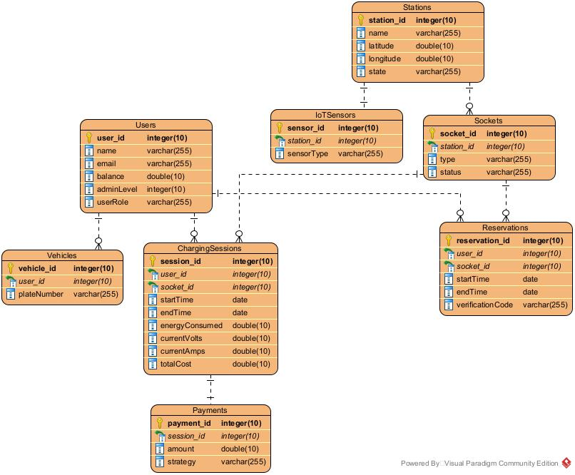

# ⚡ EV Charging Station Network System

> An Electric Vehicle (EV) Charging Network platform modeled with Object-Oriented Design (OOD) principles and modern design patterns, featuring IoT-enabled real-time monitoring, a comprehensive reservation system, and a smart payment infrastructure.


## 📌 Project Overview
This project aims to build a robust, scalable backend architecture for an Electric Vehicle (EV) charging network. Currently in the **System Design and Architecture phase**, the project focuses on establishing a solid foundation using UML modeling before moving into implementation. 

The system manages interactions between EV Owners, System Administrators, and IoT Sensors located at the charging stations.

## 🏗️ System Architecture & Design Patterns
The system is heavily modeled around core OOP principles and utilizes several software design patterns to ensure scalability and maintainability:
* **State Pattern:** Used to manage the dynamic states of charging sockets (`AVAILABLE`, `OCCUPIED`, `RESERVED`, `FAULTY`).
* **Strategy Pattern:** Implemented in the payment module to seamlessly swap between different payment methods (Credit Card, Wallet, etc.).
* **Observer Pattern:** Utilized for real-time IoT sensor communication, notifying users instantly about vehicle detection or charging progress.

---

## 📊 System Models & Diagrams

*Note: The original source files are located in the `/vp-source` directory.*

### 1. Use Case Diagram
High-level interactions between the actors (User, Admin, IoT Sensors, Database, Payment System) and the core functionalities.


### 2. Class Diagram (Domain Model)
The structural blueprint of the system, illustrating entities, relationships, and design pattern implementations.


### 3. Entity Relationship Diagram (Database Schema)
The relational data model designed to persist users, stations, sessions, and transactions.

 

---

## 🔄 System Workflows (Activity Analysis)
Detailed operational flows have been modeled for the following processes to ensure logic consistency:

* **User Management:** System registration, login, and vehicle plate verification.
* **Reservation Lifecycle:** Real-time station searching via map, socket selection, and booking confirmation.
* **Charging Operations:** Secure cable locking, real-time voltage/current monitoring, and automated session termination.
* **IoT & Anomaly Control:** Automated occupancy detection via camera sensors and admin reporting for unauthorized parking.
* **Payment & Billing:** Dynamic cost calculation based on energy consumption and automated receipt generation.

---

## 🗂️ Repository Structure

```text
├── images/                 # Exported diagrams (Use Case, Class, ER)
├── vp-source/              # Original .vpp Visual Paradigm source files
└── README.md
```
## 🚀 Upcoming Implementation Phases
[x] Requirement Gathering & Use Case Analysis

[x] UML Modeling & System Architecture Design (Current Phase)

[x] Database Schema (ERD) Design

[x] Mobile App. Interface Design

[ ] Backend API Development

[ ] IoT Sensor Data Simulation

---
Developers: Yaprak Cihantimur & Cansu Eğri & Aleyna Aytan
